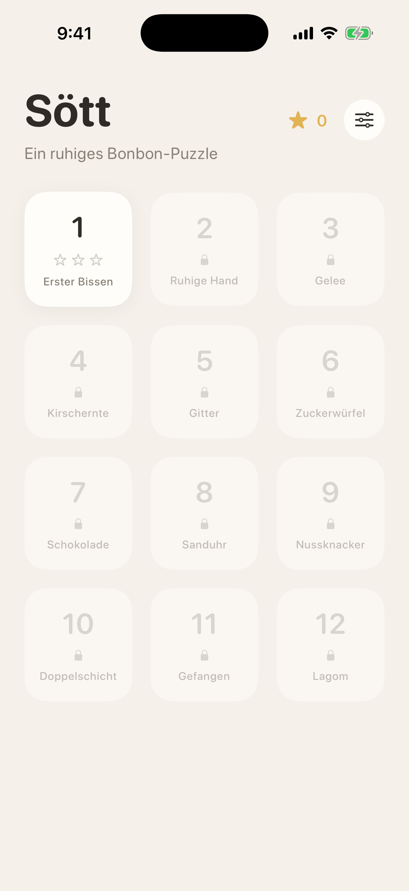
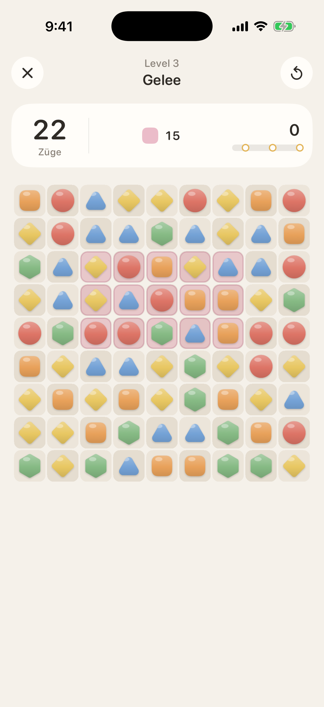
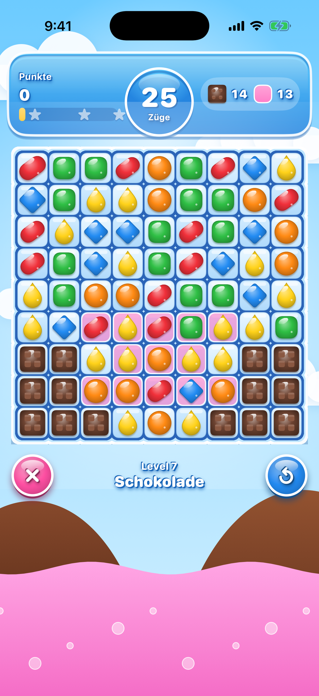
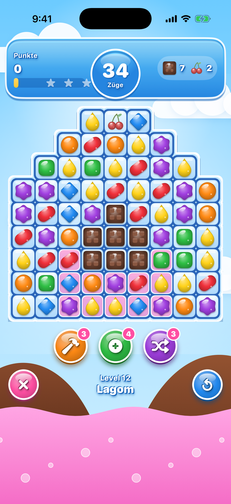

# Sött

Ein Match-3-Spiel für iOS im bunten Bonbon-Look: Himmel mit Wolken, glänzende Bonbons,
blaues Banner mit Zügen und Zielen. Arbeitstitel „Sött“ (schwedisch für „süß“).

<p>
  
  
  
  
</p>

Die Screenshots erzeugt die CI im iPhone-Simulator (`scripts/screenshots.sh`).

## Projekt öffnen

1. `Soett.xcodeproj` in Xcode 16 oder neuer öffnen.
2. Unter *Signing & Capabilities* dein Team wählen und bei Bedarf die Bundle-ID `de.vcoder001.soett` anpassen.
3. Ziel „Soett“ auf einem iPhone-Simulator oder Gerät starten.

Die Spiellogik liegt im lokalen Swift-Paket `Match3Core`, das Xcode automatisch einbindet.

## TestFlight

Der Workflow `.github/workflows/testflight.yml` baut bei jeder Änderung an der App ein Release-Archiv
und lädt es zu App Store Connect hoch (`scripts/testflight.sh`). Signiert wird automatisch über einen
App-Store-Connect-API-Schlüssel, Zertifikate oder Profile liegen nicht im Repo.

Einmalig einrichten:

1. Auf developer.apple.com unter *Identifiers* die App-ID `de.vcoder001.soett` anlegen.
2. In App Store Connect unter *Apps* eine neue iOS-App mit dieser Bundle-ID anlegen.
3. In App Store Connect unter *Benutzer und Zugriff → Integrationen → App Store Connect API* einen
   Team-Schlüssel mit der Rolle *Admin* erzeugen und die `.p8`-Datei laden.
4. Im GitHub-Repo unter *Settings → Secrets and variables → Actions* vier Secrets anlegen:
   `ASC_KEY_ID`, `ASC_ISSUER_ID`, `ASC_KEY_P8` (kompletter Inhalt der `.p8`-Datei) und
   `APPLE_TEAM_ID` (steht auf developer.apple.com unter *Membership*).

Ohne diese Secrets baut der Workflow nur ein unsigniertes Archiv als Probe. Die Build-Nummer ist die
Laufnummer des Workflows, die Version steht in `MARKETING_VERSION` im Xcode-Projekt.

## Aufbau

| Ordner | Inhalt |
| --- | --- |
| `Match3Core/` | Reine Spiellogik ohne UI, mit Unit-Tests (`swift test`, läuft auch unter Linux) |
| `App/` | SwiftUI-Oberfläche, SpriteKit-Spielfeld, Sound und Haptik |
| `App/Scene/GameScene.swift` | Spielt jeden Zug als Animation ab (Tausch, Platzen, Fallen, Nachrutschen) |
| `App/Scene/CandyArt.swift` | Zeichnet alle Bonbons im Code, jede Farbe hat eine eigene Form |
| `App/Services/SoundManager.swift` | Soundeffekte mit Tonhöhe für Kettenreaktionen, Musik-Loop, Combo-Stimme |
| `App/Sounds/` | Soundeffekte und Musik, erzeugt mit `scripts/make_sounds.py` (alles synthetisch, keine Lizenzen) |

## Regeln

- 9x9-Feld mit 5–6 Farben. Drei gleiche in einer Reihe oder Spalte platzen.
- Bonbons fallen nach, neue kommen von oben, Kettenreaktionen laufen automatisch weiter.
- Ein Tausch ohne Treffer wird zurückgespielt und kostet keinen Zug.
- Gibt es keinen möglichen Zug mehr, wird das Feld gemischt.
- Punkte-Level laufen bis zum letzten Zug. Alle anderen Level enden, sobald die Ziele erfüllt sind.
- **Zuckerrausch:** Nach einem Sieg gehen übrige Spezial-Bonbons hoch, und jeder übrige Zug wird zu einem
  Streifen-Bonbon, das sofort zündet. So sind drei Sterne erreichbar.

| Kombination | Ergebnis | Effekt |
| --- | --- | --- |
| 4 in einer Reihe | Gestreiftes Bonbon | Räumt eine ganze Spalte (bei waagerechter Vierer-Reihe) bzw. Zeile |
| 2x2-Quadrat | Fisch | Fliegt zu Gelee, Hindernis oder Gitter und trifft es |
| L- oder T-Form | Verpacktes Bonbon | Explodiert 3x3, fällt nach und explodiert ein zweites Mal |
| 5 in einer Reihe | Farbbombe | Räumt alle Bonbons der Farbe, mit der sie getauscht wird |

Spezial-Kombis beim Tauschen: Streifen + Streifen (Kreuz), Streifen + Verpackt (drei Zeilen und Spalten),
Verpackt + Verpackt (5x5), Farbbombe + Streifen/Verpackt/Fisch (alle Bonbons dieser Farbe werden zum Spezial),
Farbbombe + Farbbombe (ganzes Feld), Fisch + Spezial (Fisch trägt den Effekt ins Ziel).

**Level-Ziele:** Punkte, Gelee (einfach und doppelt), Zutaten (Kirschen, Haselnüsse) nach unten bringen,
Schokolade entfernen.
**Hindernisse:** Schokolade (breitet sich aus, wenn in einem Zug keine zerstört wurde), Gitter
(Bonbon ist fest, ein Treffer löst das Gitter), Zuckerwürfel-Blockaden (2 oder 3 Treffer).

## Level bauen

Level stehen in `Match3Core/Sources/Match3Core/Levels.swift`, ein Zeichen pro Feld:

```
.  Bonbon          #  kein Feld         j  Gelee          J  doppeltes Gelee
l  Gitter          k  Gitter + Gelee    c  Schokolade     b  Blockade (2)
B  Blockade (3)    i  Kirsche           h  Haselnuss
```

## Eigene Sounds

Die Sounds werden zur Laufzeit synthetisiert. Echte Aufnahmen einfach als Datei in `App/` legen,
sie haben automatisch Vorrang: `pop`, `crunch`, `swap`, `special`, `bomb`, `invalid`, `collect`, `win`, `lose`
sowie `voice_sweet`, `voice_tasty`, `voice_delicious`, `voice_divine` (jeweils `.caf`, `.wav`, `.m4a` oder `.mp3`).

## Tests

```
cd Match3Core
swift test
```

Die Tests decken Match-Erkennung, Tausch, Gravitation, Kaskaden, alle Spezial-Bonbons und Kombis,
Hindernisse, Ziele, Mischen sowie die Spielbarkeit aller Level ab.
