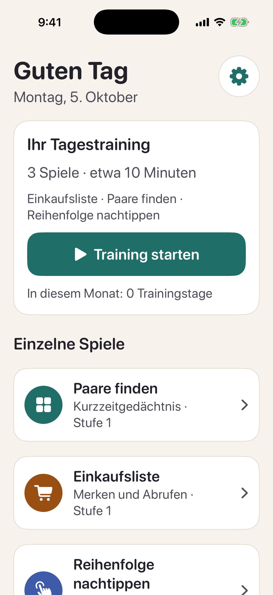
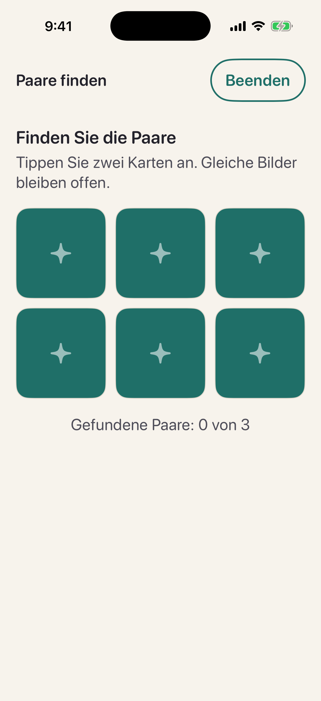
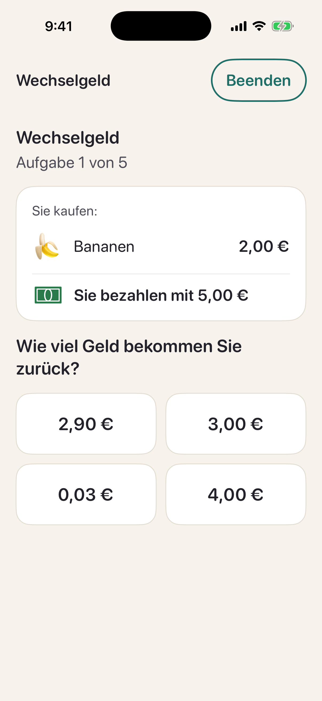

# Klarkopf

Ruhiges Gedächtnistraining für iOS, gedacht für Menschen ab 55: täglich etwa 10 Minuten, große Schrift,
kein Zeitdruck, keine Werbung. Klarkopf verspricht geistige Aktivität, keine Wirkung gegen Krankheiten.
Die App ist aus dem Bonbon-Spiel „Sött“ entstanden, das als Entspannungsspiel erhalten bleibt.

<p>
  
  
  
  
</p>

Die Screenshots erzeugt die CI im iPhone-Simulator (`scripts/screenshots.sh`).

## Klarkopf

- **Tagestraining:** Einkaufsliste merken, zwei weitere Spiele, Einkaufsliste wieder abrufen, kurzer Rückblick.
  Die zwei mittleren Spiele sind die, die am längsten nicht gespielt wurden (`DailyPlan`).
- **Spiele:** Paare finden, Einkaufsliste, Reihenfolge nachtippen, Wechselgeld, dazu das Bonbon-Puzzle.
- **Schwierigkeit:** Jedes Spiel hat 20 Stufen (`SkillLevel`). Zwei Runden mit mindestens 80 % machen es eine
  Stufe schwerer, eine Runde unter 50 % eine Stufe leichter.
- **Daten:** Stufen und Trainingstage bleiben auf dem Gerät (`TrainingStore`, UserDefaults).
- Die Spiellogik liegt in `Match3Core/Sources/Match3Core/Training` und ist mit `swift test` getestet,
  die Oberfläche in `App/Klarkopf`.
- Demo-Startparameter für Screenshots: `-demoScreen training|pairs|sequence|change|list|puzzle`.

## Projekt öffnen

1. `Soett.xcodeproj` in Xcode 16 oder neuer öffnen.
2. Unter *Signing & Capabilities* dein Team wählen und bei Bedarf die Bundle-ID `de.vcoder001.soett` anpassen.
3. Ziel „Soett“ auf einem iPhone-Simulator oder Gerät starten.

Die Spiellogik liegt im lokalen Swift-Paket `Match3Core`, das Xcode automatisch einbindet.

## TestFlight

Der Workflow `.github/workflows/testflight.yml` baut bei jeder Änderung an der App ein Release-Archiv
und lädt es zu App Store Connect hoch (`scripts/testflight.sh`). Signiert wird automatisch über einen
App-Store-Connect-API-Schlüssel, Zertifikate oder Profile liegen nicht im Repo.

Einmalig einrichten:

1. Auf developer.apple.com unter *Identifiers* die App-ID `de.vcoder001.soett` anlegen.
2. In App Store Connect unter *Apps* eine neue iOS-App mit dieser Bundle-ID anlegen.
3. In App Store Connect unter *Benutzer und Zugriff → Integrationen → App Store Connect API* einen
   Team-Schlüssel mit der Rolle *Admin* erzeugen und die `.p8`-Datei laden.
4. Im GitHub-Repo unter *Settings → Secrets and variables → Actions* vier Secrets anlegen:
   `ASC_KEY_ID`, `ASC_ISSUER_ID`, `ASC_KEY_P8` (kompletter Inhalt der `.p8`-Datei) und
   `APPLE_TEAM_ID` (steht auf developer.apple.com unter *Membership*).

Ohne diese Secrets baut der Workflow nur ein unsigniertes Archiv als Probe. Die Build-Nummer ist die
Laufnummer des Workflows, die Version steht in `MARKETING_VERSION` im Xcode-Projekt.

## Aufbau

| Ordner | Inhalt |
| --- | --- |
| `Match3Core/` | Reine Spiellogik ohne UI, mit Unit-Tests (`swift test`, läuft auch unter Linux) |
| `App/` | SwiftUI-Oberfläche, SpriteKit-Spielfeld, Sound und Haptik |
| `App/Scene/GameScene.swift` | Spielt jeden Zug als Animation ab (Tausch, Platzen, Fallen, Nachrutschen) |
| `App/Scene/CandyArt.swift` | Zeichnet alle Bonbons im Code, jede Farbe hat eine eigene Form |
| `App/Services/SoundManager.swift` | Soundeffekte mit Tonhöhe für Kettenreaktionen, Musik-Loop, Combo-Stimme |
| `App/Sounds/` | Soundeffekte und Musik, erzeugt mit `scripts/make_sounds.py` (alles synthetisch, keine Lizenzen) |

## Regeln

- 9x9-Feld mit 5–6 Farben. Drei gleiche in einer Reihe oder Spalte platzen.
- Bonbons fallen nach, neue kommen von oben, Kettenreaktionen laufen automatisch weiter.
- Ein Tausch ohne Treffer wird zurückgespielt und kostet keinen Zug.
- Gibt es keinen möglichen Zug mehr, wird das Feld gemischt.
- Punkte-Level laufen bis zum letzten Zug. Alle anderen Level enden, sobald die Ziele erfüllt sind.
- **Zuckerrausch:** Nach einem Sieg gehen übrige Spezial-Bonbons hoch, und jeder übrige Zug wird zu einem
  Streifen-Bonbon, das sofort zündet. So sind drei Sterne erreichbar.

| Kombination | Ergebnis | Effekt |
| --- | --- | --- |
| 4 in einer Reihe | Gestreiftes Bonbon | Räumt eine ganze Spalte (bei waagerechter Vierer-Reihe) bzw. Zeile |
| 2x2-Quadrat | Fisch | Fliegt zu Gelee, Hindernis oder Gitter und trifft es |
| L- oder T-Form | Verpacktes Bonbon | Explodiert 3x3, fällt nach und explodiert ein zweites Mal |
| 5 in einer Reihe | Farbbombe | Räumt alle Bonbons der Farbe, mit der sie getauscht wird |

Spezial-Kombis beim Tauschen: Streifen + Streifen (Kreuz), Streifen + Verpackt (drei Zeilen und Spalten),
Verpackt + Verpackt (5x5), Farbbombe + Streifen/Verpackt/Fisch (alle Bonbons dieser Farbe werden zum Spezial),
Farbbombe + Farbbombe (ganzes Feld), Fisch + Spezial (Fisch trägt den Effekt ins Ziel).

**Level-Ziele:** Punkte, Gelee (einfach und doppelt), Zutaten (Kirschen, Haselnüsse) nach unten bringen,
Schokolade entfernen.
**Hindernisse:** Schokolade (breitet sich aus, wenn in einem Zug keine zerstört wurde), Gitter
(Bonbon ist fest, ein Treffer löst das Gitter), Zuckerwürfel-Blockaden (2 oder 3 Treffer).

## Booster

Jeder Spieler startet mit je 3 Boostern. Wer ein Level zum ersten Mal schafft, bekommt einen dazu
(Hammer, Extra-Züge und Farbmischer wechseln sich ab). Der Vorrat liegt im `ProgressStore`.

| Booster | Wann | Wirkung |
| --- | --- | --- |
| Hammer | im Level | Antippen, dann ein Feld wählen: zerschlägt Bonbon, Gitter oder Hindernis (Zutaten nicht). Ein Spezial-Bonbon dort zündet. Kettenreaktionen laufen normal weiter. |
| Extra-Züge | vor dem Start, im Level, nach „Keine Züge mehr“ | +5 Züge. Auf der Startkarte zuschaltbar; nach einer Niederlage geht das Level damit weiter. |
| Farbmischer | im Level | Mischt alle beweglichen Bonbons neu (ohne Treffer, mit mindestens einem Zug). |

Hammer und Farbmischer kosten keinen Zug und lassen keine Schokolade wachsen. Wer ein Level ganz ohne
Booster schafft, sieht auf dem Ergebnis „Ohne Booster geschafft“. Die Regeln stehen in `Game.useHammer`,
`Game.addMoves` und `Game.useColorMixer`, die Tests in `BoosterTests.swift`.

## Mischlabor (Prototyp)

Über den Knopf „Mischlabor“ auf der Karte gibt es fünf Test-Level für eine neue Mechanik:
Bildet ein Tausch gleichzeitig zwei Reihen in verschiedenen Farben, die sich berühren, entsteht an der
Tauschstelle ein **Mischbonbon** aus beiden Farben. Es passt zu beiden Farben, kann also zwei Reihen
verbinden, und wird serviert, sobald es in einer Reihe (oder durch ein Spezial-Bonbon) platzt. Ziel der
Labor-Level ist `serveMixes`: eine Anzahl Mischbonbons servieren. Im Labor zeigt der Tipp bevorzugt einen
Zug, der ein Mischbonbon ergibt.

Die Mechanik hängt am Schalter `mixing` eines Levels und ist in der normalen Kampagne aus. Nur der Zug des
Spielers mischt, Kettenreaktionen nicht: So bleibt das Mischen eine gezielte Fertigkeit statt Zufall.
Ein Bot serviert im Schnitt rund 8 Mischbonbons in 20 Zügen, wenn er gezielt darauf spielt.

## Level bauen

Das Spiel hat 1012 Level in Episoden zu je sechs. Die ersten 12 sind von Hand gebaut, die übrigen 1000
erzeugt `LevelGenerator.swift` aus einem festen Startwert pro Level: Sie sehen auf jedem Gerät und nach
jedem Update gleich aus, ohne dass eine Level-Datei mitgeliefert wird. Der Generator kombiniert
symmetrische Spielfeldformen mit Zielen (Punkte, Gelee, Zutaten, Schokolade und Kombinationen daraus)
und Hindernissen. Die Schwierigkeit steigt über das ganze Spiel langsam an, und in jeder Episode ist das
letzte Level das schwerste. Zugzahlen und Sterne-Grenzen sind mit einem Bot abgestimmt, der jedes Level
auf vielen Startwerten durchspielt. Ein Test prüft eine Prüfsumme über alle erzeugten Level, damit sie
sich nicht versehentlich ändern, denn der Spielstand hängt an der Level-Nummer.

Handgebaute Level stehen in `Match3Core/Sources/Match3Core/Levels.swift`, ein Zeichen pro Feld:

```
.  Bonbon          #  kein Feld         j  Gelee          J  doppeltes Gelee
l  Gitter          k  Gitter + Gelee    c  Schokolade     b  Blockade (2)
B  Blockade (3)    i  Kirsche           h  Haselnuss
```

In Tests schreibt `Board.parse` ein Mischbonbon als `%RY` (rot und gelb).

## Eigene Sounds

Die Sounds werden zur Laufzeit synthetisiert. Echte Aufnahmen einfach als Datei in `App/` legen,
sie haben automatisch Vorrang: `pop`, `crunch`, `swap`, `special`, `bomb`, `invalid`, `collect`, `win`, `lose`
sowie `voice_sweet`, `voice_tasty`, `voice_delicious`, `voice_divine` (jeweils `.caf`, `.wav`, `.m4a` oder `.mp3`).

## Tests

```
cd Match3Core
swift test
```

Die Tests decken Match-Erkennung, Tausch, Gravitation, Kaskaden, alle Spezial-Bonbons und Kombis,
Hindernisse, Ziele, Mischen sowie die Spielbarkeit aller Level ab.
